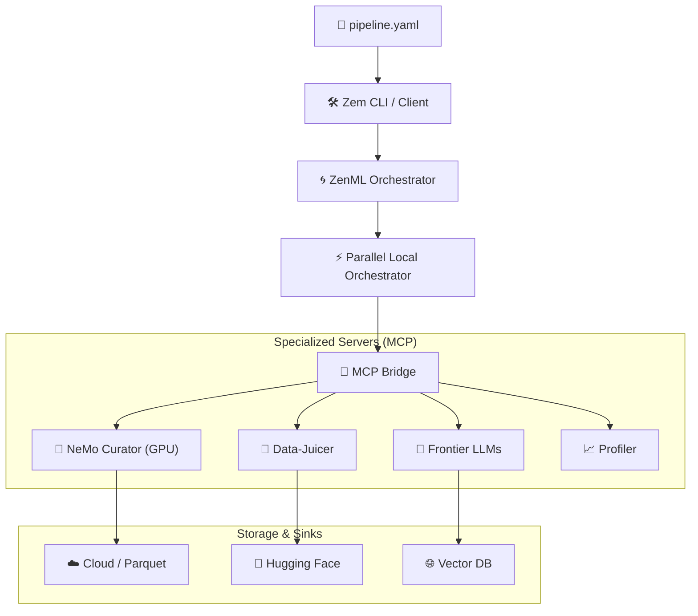

# 🚀 Zem

[](https://github.com/OAI-Labs/xfmr-zem/releases)
[](LICENSE)
[](https://zenml.io)
[](https://modelcontextprotocol.io)

**Zem** is a high-performance, unified data pipeline framework designed for the modern AI era. It seamlessly bridges **ZenML's** production-grade orchestration with specialized curation powerhouses like **NVIDIA NeMo Curator** and **Alibaba Data-Juicer** using the **Model Context Protocol (MCP)**.

---

## ✨ Key Features

- 🏗️ **Config-Driven Power**: Define complex, production-ready pipelines in single YAML files.
- ⚡ **True Parallel DAGs**: Execute independent processing branches concurrently using a custom `ParallelLocalOrchestrator`.
- 🧠 **Frontier LLM Integration**: Smart data masking, classification, and summarization via **Ollama** or **OpenAI**.
- 📊 **Deep Observability**: Real-time profiling, per-tool performance metrics, and a beautiful integrated dashboard.
- 🔄 **Adaptive Caching**: Fine-grained, step-level cache control to optimize your development cycles.
- 🔌 **Cloud Native**: Native support for S3, GCS, and Parquet with seamless export to **Hugging Face Hub** and **Vector DBs**.

---

## 🏗️ Architecture


```mermaid
graph TD
    YAML["📄 pipeline.yaml"] --> Client["🛠️ Zem CLI / Client"]
    Client --> ZenML["🌀 ZenML Orchestrator"]
    ZenML --> Parallel["⚡ Parallel Local Orchestrator"]
    Parallel --> MCP_Bridge["🔗 MCP Bridge"]
    
    subgraph "Specialized Servers (MCP)"
        MCP_Bridge --> Nemo["🦁 NeMo Curator (GPU)"]
        MCP_Bridge --> DJ["🧃 Data-Juicer"]
        MCP_Bridge --> LLM["🤖 Frontier LLMs"]
        MCP_Bridge --> Prof["📈 Profiler"]
    end
    
    subgraph "Storage & Sinks"
        Nemo --> S3["☁️ Cloud / Parquet"]
        DJ --> HF["🤗 Hugging Face"]
        LLM --> VDB["🌐 Vector DB"]
    end
```

---

## 🚀 Quick Start

### 1. Installation
```bash
git clone https://github.com/OAI-Labs/xfmr-zem.git
cd xfmr-zem
uv sync
```

### 2. Initialize a New Project
```bash
# Bootstrap a standalone project with a sample agent
uv run zem init my_project
cd my_project
```

### 3. Run Your First Pipeline
```bash
uv run zem run pipeline.yaml
```

### 4. Visualize & Inspect
```bash
# Open ZenML Dashboard
uv run zem dashboard

# Preview results with sampling
uv run zem preview <artifact_id> --sample --limit 5
```

---

## 📦 Data Versioning (DVC)

Zem tích hợp sẵn DVC để quản lý phiên bản dữ liệu lớn, sử dụng MinIO (S3-compatible) làm remote storage.

### Cấu hình credentials

```bash
export DVC_MINIO_ENDPOINT=
export DVC_MINIO_BUCKET=
export DVC_MINIO_ACCESS_KEY=
export DVC_MINIO_SECRET_KEY=
```

### Workflow

```bash
# Khởi tạo project với DVC + MinIO
uv run zem init my_project --dvc-remote minio

# Track dataset
cd my_project
uv run zem data add data/dataset.parquet -m "add training data v1"

# Push lên remote / Pull về
uv run zem data push
uv run zem data pull

# Kiểm tra trạng thái & lineage
uv run zem data status
uv run zem data lineage data/dataset.parquet
```

DVC metadata (hash, git commit) được tự động log vào ZenML artifact khi pipeline chạy, đảm bảo truy xuất đúng data version cho mỗi experiment.

---

## 📖 Guided Documentation

| Topic | Description | Link |
|-------|-------------|------|
| **Core Concepts** | Understand the Zem architecture and MCP model. | [AGENTS.md](AGENTS.md) |
| **Pipeline YAML** | How to write and validate your pipeline configs. | [Standard Example](tests/manual/standard_data_pipeline.yaml) |
| **Advanced Parallelism** | Setup true local concurrency. | [Parallel Guide](tests/manual/parallel_test.yaml) |
| **LLM & Sinks** | Connecting to external AI stacks. | [Phase 4 Demo](tests/manual/phase4_test.yaml) |

---

## 🤝 Contributing

We welcome contributions! Whether it's a new MCP server, a performance fix, or a typo in the docs, feel free to open a Pull Request. 

1. Fork the Project
2. Create your Feature Branch (`git checkout -b feature/AmazingFeature`)
3. Commit your Changes (`git commit -m 'Add some AmazingFeature'`)
4. Push to the Branch (`git push origin feature/AmazingFeature`)
5. Open a Pull Request

---

## ⚖️ License

Distributed under the **Apache-2.0 License**. See `LICENSE` for more information.

---

<p align="center">
  Built with ❤️ by the <b>OAI-Labs</b> Team
</p>
